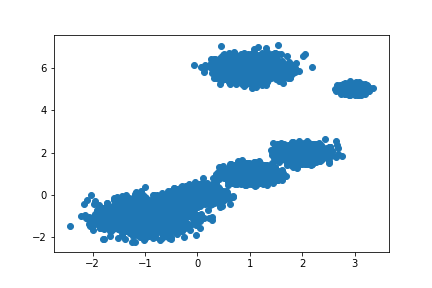
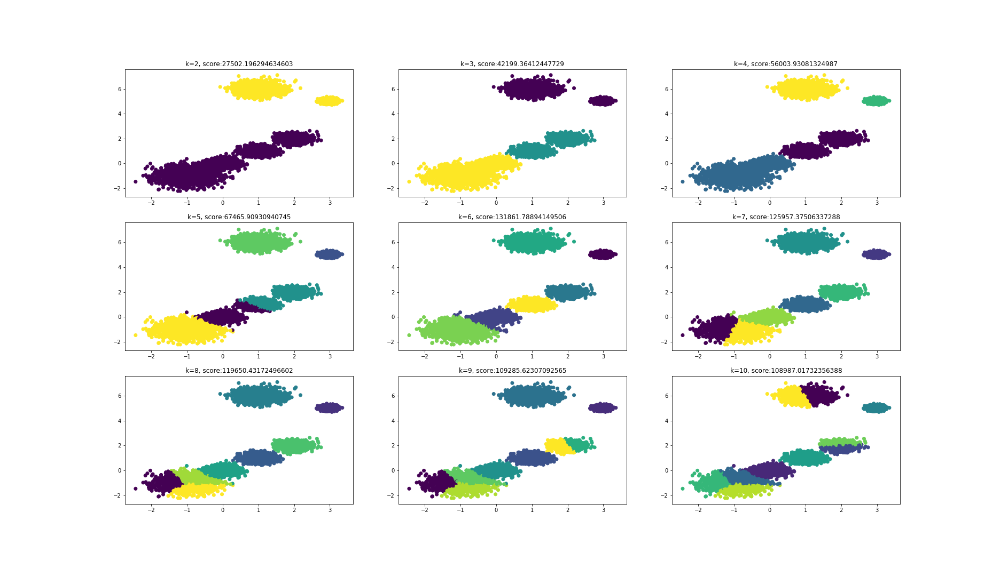

# 机器学习基础：Kmeans算法及其优化

## CONTENT

1. [算法原理](#t1)
2. [算法流程](#t2)
3. [算法优化](#t3)
   - Kmeans++
   - Elkan Kmeans
   - Mini Batch Kmeans
4. [与KNN的区别](#t4)
5. [算法小结](#t5)
6. [sklearn代码实践](#t6)


<a id='t1'></a>

## 1. 算法原理

对于给定的样本集，按照样本之间的距离大小，将样本集划分为K个簇。让簇内的点尽量紧密的连在一起，而让簇间的距离尽量的大。即：
$$
假设簇划分为(C_1,C_2,...C_k)，则我们的目标是最小化平方误差E：\\
E = \sum_{i=1}^{K}\sum_{x\in C_i}\left\|x-\mu_i\right\|_2^2 \\
其中μi是簇Ci的均值向量，也称为质心，表达式为：\\
\mu_i = \frac{1}{\mid C_i \mid}\sum_{x \in C_i}x
$$
求解思想是：

- 先初始k个簇的质心；
- 然后分别求样本中所有点到这k质心的距离，并标记每个样本的类别为和该样本距离最小的质心的类别；
- 更新k个质心；
- 重复以上两步， 如果所有的k个质心向量都没有发生变化，则停止。

Kmeans的思想比较简单，用下面一组图就可以形象的描述：


上图a表达了初始的数据集，假设k=2。在图b中，我们随机选择了两个k类所对应的类别质心，即图中的红色质心和蓝色质心，然后分别求样本中所有点到这两个质心的距离，并标记每个样本的类别为和该样本距离最小的质心的类别，如图c所示，经过计算样本和红色质心和蓝色质心的距离，我们得到了所有样本点的第一轮迭代后的类别。此时我们对我们当前标记为红色和蓝色的点分别求其新的质心，如图4所示，新的红色质心和蓝色质心的位置已经发生了变动。图e和图f重复了我们在图c和图d的过程，即将所有点的类别标记为距离最近的质心的类别并求新的质心。最终我们得到的两个类别如图f。当然在实际K-Mean算法中，我们一般会多次运行图c和图d，才能达到最终的比较优的类别。


<a id='t2'></a>

## 2. 算法流程

$$
假设：输入是样本集D={x_1,x_2,...x_m},聚类的簇树k,最大迭代次数N,输出是簇划分C={C_1,C_2,...C_k} \\
\begin{split}
	&1): 从数据集D中随机选择k个样本作为初始的k个质心向量： {μ_1,μ_2,...,μ_k}\\
	&2): 将簇划分C初始化为C_t=\emptyset \, (t=1,2...k)\\
	&3): 对于i=1,2...m,计算样本x_i和各个质心向量μ_j(j=1,2,...k)的距离：d_{ij}=\left\|x-\mu_j\right\|_2^2，\\ &将x_i标记最小的为d_{ij}所对应的类别λ_i。此时更新C_{λ_i}=C_{λ_i}\cup{x_i} \\
	&4):  对于j=1,2,...,k,对C_j中所有的样本点重新计算新的质心μ_j=\frac{1}{|C_j|}\sum_{x∈C_j}x \\
	&5): 循环2-4步，如果所有的k个质心向量都没有发生变化，则输出簇划分C={C_1,C_2,...C_k}
\end{split}
$$


<a id='t3'></a>

## 3. 算法优化

### 3.1 kmeans++

kmeans中k个初始化的质心的位置选择对最后的聚类结果和运行时间都有很大的影响，因此需要选择合适的k个质心。如果仅仅是完全随机的选择，有可能导致算法收敛很慢。K-Means++算法就是对K-Means随机初始化质心的方法的优化。K-Means++的对于初始化质心的优化策略如下：
$$
\begin{split}
	&1): 从输入的数据点集合中随机选择一个点作为第一个聚类中心μ_1 \\
	&2): 对于数据集中的每一个点x_i，计算它与已选择的聚类中心中最近聚类中心的距离\\ &D(x_i)=arg\,min||x_i−μ_j||_2^2\,(j=1,2,...k_{selected}) \\
	&3): 选择一个新的质心，选择的原则是：D(x)较大的点，被选取作为聚类中心的概率较大\\
	&4): 重复2和3直到选择出k个聚类质心 \\
	&5): 利用这k个质心来作为初始化质心去运行标准的Kmeans算法
\end{split}
$$

### 3.2 Elkan kmeans

在传统的K-Means算法中，我们在每轮迭代时，要计算所有的样本点到所有的质心的距离，这样会比较的耗时。那么，对于距离的计算有没有能够简化的地方呢？elkan K-Means算法就是从这块入手加以改进。它的目标是减少不必要的距离的计算。主要基于以下两种策略：
$$
\begin{split}
	&1): 第一种规律是对于一个样本点x和两个质心μj1,μj2。如果我们预先计算出了这两个质心之间的\\&距离D(j_1,j_2)，则如果计算发现2D(x,j_1)≤D(j_1,j_2),我们立即就可以知道D(x,j_1)≤D(x,j_2)。\\&此时我们不需要再计算D(x,j_2),也就是说省了一步距离计算。\\
	&2): 第二种规律是对于一个样本点x和两个质心μ_{j_1},μ_{j_2}。得到D(x,j_2)≥max\{0,D(x,j_1)−D(j_1,j_2)\}。
\end{split}
$$
利用上边的两个规律，elkan K-Means比起传统的K-Means迭代速度有很大的提高。但是如果我们的样本的特征是稀疏的，有缺失值的话，这个方法就不使用了，此时某些距离无法计算，则不能使用该算法。

### 3.3 Mini Batch kmeans

在统的K-Means算法中，要计算所有的样本点到所有的质心的距离。如果样本量非常大，比如达到10万以上，特征有100以上，此时用传统的K-Means算法非常的耗时，就算加上elkan K-Means优化也依旧。在大数据时代，这样的场景越来越多。此时Mini Batch K-Means应运而生。

Mini Batch，也就是用样本集中的一部分的样本来做传统的K-Means，这样可以避免样本量太大时的计算难题，算法收敛速度大大加快。当然此时的代价就是我们的聚类的精确度也会有一些降低。一般来说这个降低的幅度在可以接受的范围之内。

一般是通过无放回的随机采样得到batch， 然后仅仅用batch size个样本来做K-Means聚类，一般会多跑几次Mini Batch K-Means算法，用得到不同的随机采样集来得到聚类簇，选择其中最优的聚类簇。


<a id='t4'></a>

## 4. 与KNN的区别

K-Means是无监督学习的聚类算法，没有样本输出；而KNN是监督学习的分类算法，有对应的类别输出。KNN基本不需要训练，对测试集里面的点，只需要找到在训练集中最近的k个点，用这最近的k个点的类别来决定测试点的类别。而K-Means则有明显的训练过程，找到k个类别的最佳质心，从而决定样本的簇类别。两者也有一些相似点，两个算法都包含一个过程，即找出和某一个点最近的点。两者都利用了最近邻(nearest neighbors)的思想。


<a id='t5'></a>

## 5. 算法小结

$$
\begin{split}
&K-Means的主要优点有：\\
&1）原理比较简单，实现也是很容易，收敛速度快。\\
&2）聚类效果较优。\\
&3）算法的可解释度比较强。\\
&4）主要需要调参的参数仅仅是簇数k。\\
&K-Means的主要缺点有：\\
&1）K值的选取不好把握\\
&2）对于不是凸的数据集比较难收敛\\
&3）如果各隐含类别的数据不平衡，比如各隐含类别的数据量严重失衡，或者各隐含类别的方差不同，则聚类效果不佳。\\
&4） 采用迭代方法，得到的结果只是局部最优。\\
&5） 对噪音和异常点比较的敏感。\\
\end{split}
$$


<a id='t6'></a>

## 6. sklearn代码实践

在scikit-learn中，包括两个K-Means的算法，一个是传统的K-Means算法，对应的类是KMeans。另一个是基于采样的Mini Batch K-Means算法，对应的类是MiniBatchKMeans。

### 6.1 评估方法

常见的方法有轮廓系数`Silhouette Coefficient`和`Calinski-Harabasz Index`， 一般使用`Calinski-Harabasz Index`。其计算方法如下：
$$
\begin{split}
&Calinski-Harabasz分数值s的数学计算公式是：\\
&s(k)=\frac{tr(B_k)}{tr(W_k)}\frac{m−k}{k−1} \\
&其中m为训练集样本数，k为类别数。Bk为类别之间的协方差矩阵，Wk为类别内部数据的协方差矩阵。tr为矩阵的迹。
\end{split}
$$
类别内部数据的协方差越小越好，类别之间的协方差越大越好，这样的Calinski-Harabasz分数会高。在scikit-learn中， `Calinski-Harabasz Index`对应的方法是`metrics.calinski_harabaz_score`。

### 6.2 KMeans主要参数

KMeans类的主要参数有：

- **n_clusters**: 即我们的k值，一般需要多试一些值以获得较好的聚类效果。k值好坏的评估标准在下面会讲。

- **max_iter**： 最大的迭代次数，一般如果是凸数据集的话可以不管这个值，如果数据集不是凸的，可能很难收敛，此时可以指定最大的迭代次数让算法可以及时退出循环。

- **n_init：**用不同的初始化质心运行算法的次数。由于K-Means是结果受初始值影响的局部最优的迭代算法，因此需要多跑几次以选择一个较好的聚类效果，默认是10，一般不需要改。如果你的k值较大，则可以适当增大这个值。

- **init：** 即初始值选择的方式，可以为完全随机选择'random',优化过的'k-means++'或者自己指定初始化的k个质心。一般建议使用默认的'k-means++'。

- **algorithm**：有“auto”, “full” or  “elkan”三种选择。"full"就是我们传统的K-Means算法， “elkan”是我们原理篇讲的elkan  K-Means算法。默认的"auto"则会根据数据值是否是稀疏的，来决定如何选择"full"和“elkan”。一般数据是稠密的，那么就是 “elkan”，否则就是"full"。一般来说建议直接用默认的"auto"

### 6.3 MiniBatchKMeans主要参数

MiniBatchKMeans类的主要参数比KMeans类稍多，主要有：

- **n_clusters**: 即我们的k值，和KMeans类的n_clusters意义一样。

- **max_iter：**最大的迭代次数， 和KMeans类的max_iter意义一样。

- **n_init：**用不同的初始化质心运行算法的次数。这里和KMeans类意义稍有不同，KMeans类里的n_init是用同样的训练集数据来跑不同的初始化质心从而运行算法。而MiniBatchKMeans类的n_init则是每次用不一样的采样数据集来跑不同的初始化质心运行算法。

- **batch_size**：即用来跑Mini Batch KMeans算法的采样集的大小，默认是100.如果发现数据集的类别较多或者噪音点较多，需要增加这个值以达到较好的聚类效果。

- **init：** 即初始值选择的方式，和KMeans类的init意义一样。

- **init_size:** 用来做质心初始值候选的样本个数，默认是batch_size的3倍，一般用默认值就可以了。

- **reassignment_ratio:** 某个类别质心被重新赋值的最大次数比例，这个和max_iter一样是为了控制算法运行时间的。这个比例是占样本总数的比例，乘以样本总数就得到了每个类别质心可以重新赋值的次数。如果取值较高的话算法收敛时间可能会增加，尤其是那些暂时拥有样本数较少的质心。默认是0.01。如果数据量不是超大的话，比如1w以下，建议使用默认值。如果数据量超过1w，类别又比较多，可能需要适当减少这个比例值。具体要根据训练集来决定。

- **max_no_improvement：**即连续多少个Mini Batch没有改善聚类效果的话，就停止算法， 和reassignment_ratio， max_iter一样是为了控制算法运行时间的。默认是10.一般用默认值就足够了。

### 6.4 实验

```python
import numpy as np
import matplotlib.pyplot as plt
%matplotlib inline
from sklearn.datasets.samples_generator import make_blobs
from sklearn.cluster import KMeans, MiniBatchKMeans
from sklearn import metrics
# X为样本特征，Y为样本簇类别， 共1000个样本，每个样本2个特征，共4个簇，簇中心在[-1,-1], [0,0],[1,1], [2,2]， 簇方差分别为[0.4, 0.2, 0.2]
X, y = make_blobs(n_samples=10000, n_features=2, centers=[[-1,-1], [0,0], [1,1], [2,2],[3,5],[1,6]], cluster_std=[0.4, 0.2, 0.2, 0.2,0.1,0.3], 
                  random_state =9)
plt.scatter(X[:, 0], X[:, 1], marker='o')
plt.show()
```



```python
def get_cluster(k, method='kmeans'):
    if method == 'kmeans':
        return KMeans(n_clusters=k, random_state=9)
    elif method == 'mini_batch_kmeans':
        return MiniBatchKMeans(n_clusters=k, batch_size = 200, random_state=9)
    else:
        print('Not valid')
        return None

def exp(method='kmeans'):
    res = []
    for k in range(2, 11):
        cluster = get_cluster(k, method)
        if not cluster:
            break
        y_pred = cluster.fit_predict(X)
        score = metrics.calinski_harabasz_score(X, y_pred)  
        res.append((k, X, y_pred, score))
    return res

def show_res(res):
    plt.figure(figsize=(26, 15))
    for i, (k, X, y_pred, score) in enumerate(res):
        plt.subplot(3,3,i+1)
        plt.scatter(X[:, 0], X[:, 1], c=y_pred)
        plt.title(f'k={k}, score:{score}')
    plt.show()
```

```python
res = exp()
show_res(res)
```


```python
res = exp('mini_batch_kmeans')
show_res(res)
```

